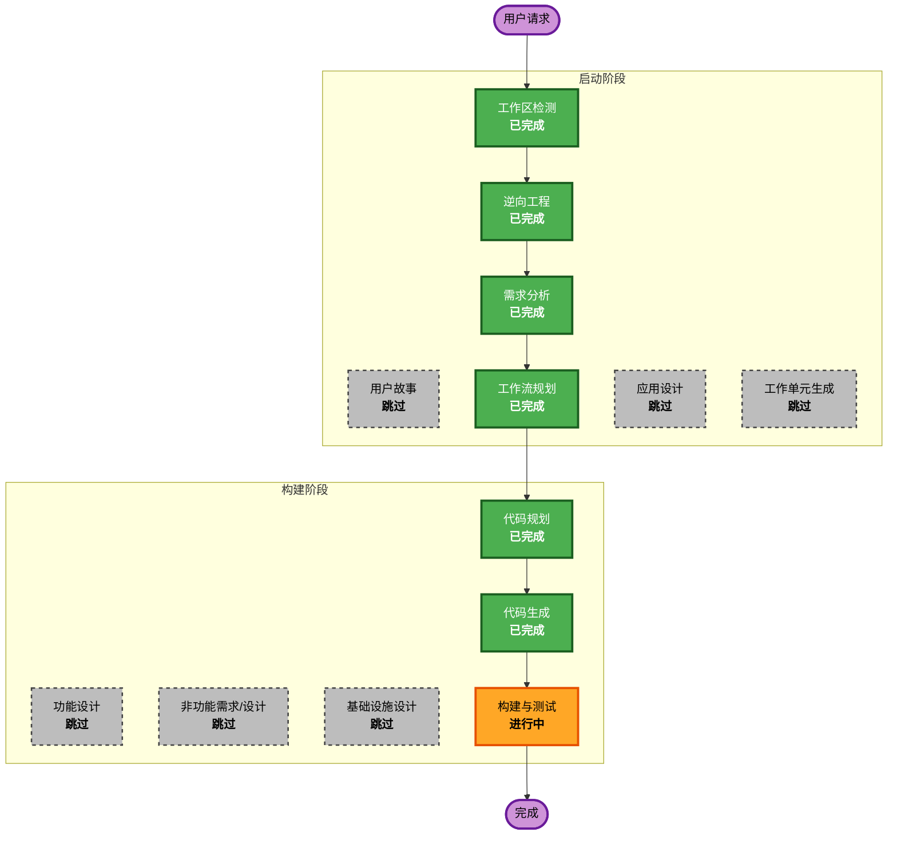

# 执行计划

## 详细分析摘要

### 变更范围（棕地项目）
- **变更类型**: 单组件增强（非架构性变更）
- **主要变更**: Flow 逻辑修复、Tool 层增强、测试框架补充
- **相关组件**: form_test_flow.py（核心）、tools/*、agents/form_filler.py、models/*、tests/*

### 变更影响评估
| 影响领域 | 涉及 | 说明 |
|---------|------|------|
| 用户可见变更 | 是 | 报告状态更准确（四级状态）、报告数据更完整（fields_filled、screenshot） |
| 结构性变更 | 否 | 不改变整体架构，在现有组件内修改 |
| 数据模型变更 | 是 | TestReport 新增 error_message 字段、PageResult.validation_errors 类型修正 |
| API 变更 | 否 | CLI 接口不变 |
| 非功能需求影响 | 是 | 错误恢复（可靠性）、日志安全（安全性） |

### 组件关系
```
+------------------+     +-----------------+     +----------------+
|   main.py (CLI)  | --> | FormTestFlow    | --> | PageCrew       |
+------------------+     | (核心修改点)     |     | (结果收集器)    |
                         +-----------------+     +----------------+
                               |                       |
                               v                       v
                         +-----------+          +-------------+
                         | 报告生成   |          | Tools       |
                         | (状态逻辑) |          | (字段收集)   |
                         +-----------+          +-------------+
                               |
                               v
                         +-----------+
                         | Models    |
                         | (类型修复) |
                         +-----------+
```

### 风险评估
- **风险级别**: 低-中
- **回滚复杂度**: 低（每个 FR 独立，可单独回滚）
- **测试复杂度**: 中（FR-01 E2E 测试依赖真实 LLM，结果有不确定性）

---

## 工作流可视化



---

## 各阶段执行/跳过决策

### 启动阶段
- [x] 工作区检测（已完成）
- [x] 逆向工程（已完成）— 9 份文档
- [x] 需求分析（已完成）— 7 FR + 2 NFR
- [x] 用户故事 — **跳过**
  - **理由**: 纯技术性 bug 修复和增强，无用户角色变更，无新用户交互流程
- [x] 工作流规划（已完成）
- [ ] 应用设计 — **跳过**
  - **理由**: 不涉及新组件或新服务，所有变更在现有组件边界内
- [ ] 工作单元生成 — **跳过**
  - **理由**: 单系统单模块，无需分解为多个工作单元

### 构建阶段
- [ ] 功能设计 — **跳过**
  - **理由**: 业务逻辑简单明确（状态计算、异常捕获、字段收集），不需要独立的功能设计文档
- [ ] 非功能需求/设计 — **跳过**
  - **理由**: NFR 已在需求文档中定义（NFR-01/02），不需要独立的 NFR 设计阶段
- [ ] 基础设施设计 — **跳过**
  - **理由**: 无基础设施变更
- [x] 代码规划 — **已完成**
  - **理由**: 7 个需求需要详细的实施步骤规划
- [x] 代码生成 — **已完成**
  - **理由**: 按计划实施代码变更，FR-07→FR-05→FR-04→FR-03→FR-02→FR-06→FR-01 全部完成
- [ ] 构建与测试 — **进行中**
  - **理由**: 99 个单元测试通过，E2E 测试已创建，待最终验证

### 运维阶段
- [ ] 运维 — 占位符（暂不执行）

---

## 模块更新策略

**更新方式**: 顺序执行（各 FR 有依赖关系）

| 顺序 | 需求 | 依赖 | 说明 |
|------|------|------|------|
| 1 | FR-07 validation_errors 类型统一 | 无 | 基础修复，其他 FR 可能触及同一文件 |
| 2 | FR-05 page_index 递增 | 无 | 修改 _run_page_loop |
| 3 | FR-04 screenshot_path 填充 | 无 | 修改 _update_state_from_crew_result |
| 4 | FR-03 四级状态逻辑 | FR-05 | 依赖 page_index 正确递增来计算状态 |
| 5 | FR-02 错误恢复 | FR-03 | 需要使用 ERROR 状态（依赖四级状态） |
| 6 | FR-06 fields_filled 双层收集 | 无 | 独立于其他 FR，但改动范围最大 |
| 7 | FR-01 E2E 测试 | 全部 | 作为最终验证，依赖所有功能修复 |

---

## 预估时间线
- **总执行阶段**: 3 个（代码规划 + 代码生成 + 构建与测试）
- **预估时长**: 代码规划 1 轮，代码生成 7 轮（每个 FR 一轮），构建与测试 1 轮

## 成功标准
- **主要目标**: 修复 E2E 测试暴露的 7 个问题，使系统报告准确反映实际执行结果
- **关键交付物**:
  - 自动化 E2E 测试（pytest -m e2e）
  - 错误恢复机制
  - 四级状态报告
  - 完整的 fields_filled 数据
- **质量门禁**:
  - 所有现有单元测试通过（72+）
  - E2E 测试通过
  - 安全基线检查（API key + 日志）
