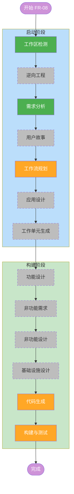

# FR-08 执行计划 — 动态测试数据生成

## 详细分析摘要

### 变更范围（棕地项目）

- **新增组件**: Data Generator Agent（`src/agents/data_generator.py`）
- **修改组件**: Flow 状态机、Crew 构建器、CLI 入口、TestCase 模型
- **不变组件**: Page Analyzer、Form Filler、Result Verifier、所有 Tool、所有 Parser、报告系统

### 变更影响评估

| 影响领域 | 涉及 | 说明 |
|----------|------|------|
| 用户界面 | 是 | 新增 `generate` CLI 子命令 |
| 数据流 | 是 | crew.kickoff inputs 新增 `generation_persona` 和 `generation_mode` |
| Agent 架构 | 是 | 条件性 5-agent crew（dynamic 模式） |
| 数据模型 | 是 | `FormTestState` 新增字段，`TestCase.data` 改为可选 |
| 现有功能 | 否 | static 模式完全不受影响（条件分支隔离） |
| 安全 | 否 | 沿用现有 PII 脱敏机制 |

### 组件关系

```
+----------------------------------------------+
|                  CLI Layer                     |
|  +----------+  +----------+  +------------+   |
|  | run      |  | generate |  | analyze    |   |
|  | (static) |  | (dynamic)|  | (readonly) |   |
|  +----+-----+  +----+-----+  +------------+   |
|       |              |                         |
+-------+--------------+-------------------------+
        |              |
        v              v
+----------------------------------------------+
|              FormTestFlow                      |
|  state.generation_mode = static | dynamic      |
|  state.generation_persona = {}                 |
+----------------------------------------------+
        |
        v
+----------------------------------------------+
|          build_page_crew()                     |
|  if dynamic:                                   |
|    [Analyzer]->[Generator]->[Mapper]->[Filler]->[Verifier]  |
|  else:                                         |
|    [Analyzer]->[Mapper]->[Filler]->[Verifier]  |
+----------------------------------------------+
```

### 风险评估

- **低风险**: TestCase.data 改为可选 — 默认值 `{}` 不影响现有解析器
- **低风险**: CLI 新增子命令 — 完全独立，不影响现有命令
- **中风险**: Crew 条件分支 — 需确保 static 模式路径完全不变
- **中风险**: Persona 跨页面累积 — LLM 可能生成不一致的数据，需要 prompt 设计得当

---

## 工作流可视化



---

## 各阶段执行/跳过决策

### 启动阶段（Inception）

- [x] **工作区检测** — 已完成。恢复会话，读取现有 `aidlc-state.md`。
- [x] **逆向工程** — 跳过。**理由**: 代码结构未发生重大变更，复用上一轮的 9 份文档。
- [x] **需求分析** — 已完成。生成了 8 个验证问题 + 正式需求文档（7 个 FR + 1 个 NFR）。
- [x] **用户故事** — 跳过。**理由**: 单一用户角色（测试工程师），纯技术功能增强，无复杂的 UX 交互变化。
- [ ] **工作流规划** — 当前阶段。生成本执行计划文档。
- [x] **应用设计** — 跳过。**理由**: Data Generator Agent 遵循现有 agent 工厂模式（`create_<role>(llm) -> Agent`），不引入新的架构模式或组件依赖。Crew 构建的条件分支是对现有函数的参数化扩展，不需要独立的组件设计文档。
- [x] **工作单元生成** — 跳过。**理由**: 所有改动在单一模块内（agent + flow + CLI），无需拆分为多个工作单元。

### 构建阶段（Construction）

- [x] **功能设计** — 跳过。**理由**: 业务逻辑简单明确（LLM 生成数据 → 合并 persona → 传递给 Mapper），无需技术无关的功能设计。
- [x] **非功能需求** — 跳过。**理由**: NFR-03（PII 脱敏）已在需求文档中定义，且由现有 filter 覆盖。
- [x] **非功能设计** — 跳过。**理由**: 同上。
- [x] **基础设施设计** — 跳过。**理由**: 无基础设施变更。
- [ ] **代码生成** — 待执行。按依赖顺序实施 FR-08-06 → FR-08-01 → FR-08-02 → FR-08-03 → FR-08-04 → FR-08-05 → FR-08-07 + NFR-03。
- [ ] **构建与测试** — 待执行。运行全量 pytest 验证回归。

---

## 模块更新策略

| 顺序 | 需求 | 文件 | 依赖 | 说明 |
|------|------|------|------|------|
| 1 | FR-08-06 | `src/models/test_case.py` | 无 | `data` 字段加默认值，最小改动 |
| 2 | FR-08-01 | `src/agents/data_generator.py` | 无 | 新建文件，无外部依赖 |
| 3 | FR-08-02 | `src/flow/page_crew.py` | FR-08-01 | 导入新 agent，条件分支构建 crew |
| 4 | FR-08-03 | `src/flow/form_test_flow.py` | FR-08-02 | 新增状态字段，传递 persona，回收生成数据 |
| 5 | FR-08-04 | `src/flow/page_crew.py` | FR-08-01/02 | prompt 设计（与 FR-08-02 同文件，顺序实施） |
| 6 | FR-08-05 | `src/main.py` | FR-08-03 | 新增 generate 子命令 |
| 7 | FR-08-07 | `tests/` | 全部 | 单元测试 + E2E 测试 |
| 8 | NFR-03 | `tests/` | FR-08-07 | 验证脱敏覆盖动态数据 |

---

## 预估时间线

| 阶段 | 预估 |
|------|------|
| 代码生成（FR-08-06 ~ FR-08-05） | 主要工作量 |
| 测试编写（FR-08-07 + NFR-03） | 中等工作量 |
| 构建与回归验证 | 较小工作量 |

---

## 成功标准

1. `ui-agent generate <url>` 命令可以访问任意表单页面并自动生成数据填写
2. 多步表单中跨页面数据保持一致（persona 机制）
3. 现有 `ui-agent run` 命令（static 模式）完全不受影响
4. 所有现有单元测试通过
5. 新增单元测试覆盖 Data Generator agent 创建、crew 条件分支、flow 状态管理、CLI 参数解析
6. E2E 测试中新增 dynamic 模式场景
7. 动态生成的数据在 INFO+ 级别日志中被 PII 脱敏
